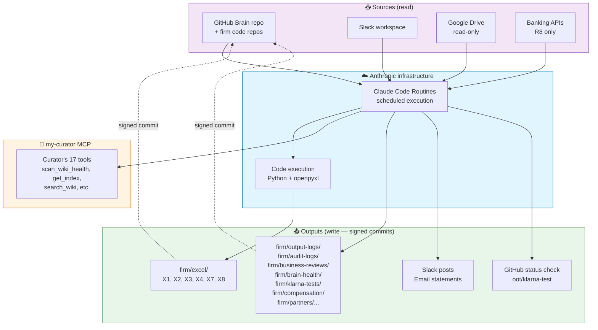
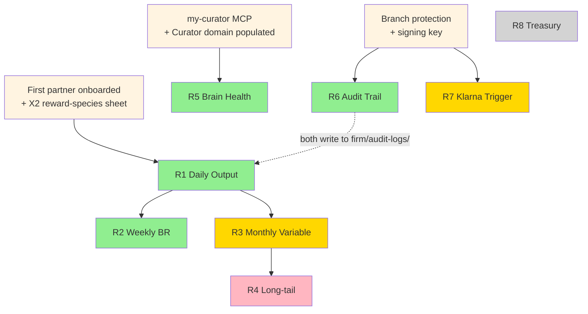

# Automation pipeline — how the 8 Routines fit together

**Audience:** Founder. After the install. Trying to understand the whole automation picture before configuring Routines.
**Time to read:** 15 minutes.
**You will end with:** a clear mental model of what each Routine does, when it fires, what depends on what, and what you actually need to set up *for your situation* — vs. what to defer.

> 📖 If you haven't read [`docs/MODULES.md`](MODULES.md) yet, do that first — this doc assumes you know the module-dependency map.

---

## What "automation" means in ØØT

The framework ships **eight scheduled Routines (R1–R8)** that turn the firm's daily work into compounding state. Each Routine is a prompt + a schedule + a set of integrations. It runs automatically (no human at the keyboard), reads from a few sources, writes to your Brain repo via signed commits, and notifies the team on Slack / dChat.

The Routines are the *only* automation in Gen 1. Everything else (partner onboarding, Klarna scoring, output spec drafting) is human-driven with AI assistance, not scheduled.

Two execution substrates, identical prompts:

- **Cloud track** — Claude Code Routines run on Anthropic's infrastructure. **Your laptop can be closed; no dedicated machine required.** Per-day limits: 5 (Pro) / 15 (Max) / 25 (Team/Enterprise). [Anthropic launch announcement →](https://claude.com/blog/introducing-routines-in-claude-code). You manage them from any of three interfaces (all configure the same cloud-hosted feature):
  - **Claude Code CLI** in your terminal: `/schedule` command
  - **Web dashboard:** [claude.ai/code/routines](https://claude.ai/code/routines)
  - **Claude Code desktop app:** "New Remote Task" feature *(this is the Claude Code-specific desktop app, distinct from Claude Desktop chat)*
- **Privacy track** — cron / launchd / Task Scheduler on your always-on machine, hitting headless LM Studio via `llmster`. **Privacy track is the one that needs a dedicated machine.** That's the structural trade-off vs. cloud track's sovereign-but-laptop-must-be-on cost.

---

## The 8 Routines at a glance

| # | Schedule | What it does | What it produces | Day-1? |
|---|---|---|---|---|
| **R5** | Sunday 09:00 | Curator brain-health scan + auto-fix safe issues | `firm/brain-health/<YYYY-WW>.md` + `#brain-health` Slack post | ✅ first Routine to install — no dependencies |
| **R6** | Daily 23:00 | Capture today's AI decisions → daily audit log (signed commit) | `firm/audit-logs/<YYYY-MM-DD>.md` + X7 Audit_Log_Index | ✅ mandatory for EU founders; recommended otherwise |
| **R1** | Daily 18:00 | Capture partner outputs (commits, contracts, deals) → X1 Output_Log | New rows in X1 + `firm/output-logs/<YYYY-MM-DD>.md` | ✅ but needs first partner with X2 sheet |
| **R2** | Friday 08:00 | Build the Friday BR agenda; populate X3 | X3 Weekly_Review row + Slack draft + `firm/business-reviews/<date>.md` | ✅ but needs R1 with 7+ days of data |
| **R3** | 1st of month 09:00 | Calculate monthly variable pay; per-partner statements; founder approval packet | X1 Monthly_Variable + per-partner statement Brain pages + email to each partner | ⏸ wait for R1 to have 30+ days of data |
| **R4** | 1st of quarter 09:00 | Settle quarterly long-tail entitlements per X2 | X2 Long_Tail_Schedule rows + per-partner long-tail statements | ⏸ first quarter close |
| **R7** | GitHub event (PR labeled `ai-replaces-human`) | Block PR merge; assign non-beneficiary reviewer; populate X4 | X4 Decision_Log + GitHub status check + `firm/klarna-tests/<test-id>.md` | ⏸ first AI-replaces-human PR |
| **R8** | Monday 08:00 | Treasury runway snapshot; threshold alerts | X8 Runway_Calc snapshot row + alert if runway < 9 months | ⏸ optional — Unit Fund only |

---

## How does a Routine touch the `.xlsx` files? (Pattern C, ADR-001)

**This is the framework's most important architectural decision and the most common point of confusion.** A cloud Routine running on Anthropic's infrastructure does NOT reach into your local machine. Instead:

```
Routine fires (Anthropic infra)
   │
   ├─► git clone https://github.com/<you>/<brain-repo> /tmp/brain
   │
   ├─► openpyxl.load_workbook('/tmp/brain/firm/excel/X1.xlsx')   ← reads from the cloned copy
   │
   ├─► append rows; write K, L formulas; save                    ← mutation in cloud sandbox
   │
   ├─► git commit -S -m "R1: append <N> outputs"                 ← signed commit
   │
   └─► git push origin main                                       ← pushes back to GitHub
```

The `.xlsx` file lives in your GitHub Brain repo. **GitHub is the canonical store.** Your local copy at `/Users/<you>/<firm-folder>/` is a working clone you keep in sync with `git pull`. The Routine has its own working clone in its cloud sandbox — they never touch each other directly. They round-trip through GitHub.

This is **track-symmetric**: privacy-track Routines do the same operation (clone → openpyxl → signed commit → push), just from your always-on machine instead of from Anthropic's cloud. Both cloud and privacy versions of R1 hit the same Brain repo on GitHub.

**Why this matters for your install:**

- ✅ You keep your `.xlsx` files in your firm folder locally for editing in Excel / LibreOffice / Numbers
- ✅ The Routines work without any local-file-access wizardry (no remote desktop, no hosted file shares, no syncing daemons)
- ✅ Every Routine mutation is a signed commit — your audit trail is automatic
- ✅ Multiple founders / partners can edit the same X1 from different machines via normal `git pull` / `git push`
- ✅ The framework works the same on cloud and privacy tracks

**Why we picked this over the abandoned alternatives** ([ADR-001](internal/ADR-001-cloud-routine-excel-writeback.md) full reasoning):

| | Approach | Why we said no |
|---|---|---|
| A | Native Google Drive connector writes Sheets in place | Connector is read-only for Sheets |
| B | Google Sheets via remote MCP | Loses openpyxl formulas; vendor lock; hosted-MCP burden |
| D | Remote Excel MCP server | Adds a hosted server to maintain; functionally equivalent to Pattern C with extra moving parts |
| **C** | **Routine clones Brain repo, openpyxl + signed commit + push** | **Track-symmetric, native .xlsx preserved, audit trail automatic, no extra infrastructure** |

---

## Cloud track pipeline



**Key flows:**

1. **Read sources** — Routine fires on schedule (or GitHub event for R7). Pulls today's commits/PRs from GitHub, watched Slack channels, watched Drive folders, banking APIs (R8).
2. **Process via Anthropic-hosted Claude** — the Routine prompt runs on Anthropic infrastructure. Code execution available for openpyxl + signed commits.
3. **Read/write Brain via my-curator MCP** — for Routines that touch the Curator (R5 mainly, R6 to find agent decisions).
4. **Write operational state** — `.xlsx` mutations via openpyxl in code execution; markdown Brain pages directly. Signed commits push to `main`.
5. **Notify** — Slack posts, email statements.

---

## Privacy track pipeline


**Key flow differences from cloud:**

- **Substrate**: cron / launchd / Task Scheduler on your always-on machine instead of Anthropic infrastructure.
- **Model**: local (Qwen 3 14B for daily; Llama 3.3 70B for R3 high-stakes) instead of Claude.
- **Comms**: 4thtech dMail/dChat replaces Slack/email.
- **Discovery**: Desktop Commander MCP for local files; GitHub MCP for the Brain repo (still GitHub-hosted).
- **my-curator MCP**: runs locally on the always-on machine — same machine as the Routines. **No reachability gap.**
- **Reliability constraint**: only fires while the machine is on. UPS strongly recommended.

---

## Routine schedule timeline

What fires when, in a typical week:

```mermaid
gantt
    title Weekly Routine schedule (cloud or privacy)
    dateFormat HH:mm
    axisFormat %H:%M

    section Sunday
    R5 Brain Health        :08:00, 60m

    section Monday
    R8 Treasury (optional) :08:00, 30m

    section Tue–Thu
    R1 Daily Output Capture :crit, 18:00, 30m
    R6 Daily Audit Trail    :crit, 23:00, 30m

    section Friday
    R2 Weekly BR Prep       :08:00, 30m
    R1 Daily Output Capture :crit, 18:00, 30m
    R6 Daily Audit Trail    :crit, 23:00, 30m

    section Saturday
    R1 Daily Output Capture :crit, 18:00, 30m
    R6 Daily Audit Trail    :crit, 23:00, 30m

    section Event-driven
    R7 Klarna Trigger       :milestone, 12:00, 0m

    section Monthly (1st)
    R3 Monthly Variable     :crit, 09:00, 90m

    section Quarterly (1st of Q)
    R4 Long-tail Settlement :crit, 09:00, 120m
```



**Daily run count for plan-tier sizing:**

- Tue–Thu: R1 + R6 = 2/day
- Friday: R2 + R1 + R6 = 3/day
- Sunday: R5 = 1/day
- Monday: R8 (optional) + R1 + R6 = 2-3/day
- Saturday: R1 + R6 = 2/day
- 1st of month: R3 + the daily Routines = 3-4 fires (plus 5-7 polling fires for partner ack across the next 5 business days)
- 1st of quarter: R4 + R3 + daily = 4-5 fires
- R7: ad-hoc; +1 per ai-replaces-human PR

**Steady state**: ~2.3 runs/day average. Pro plan (5/day) handles this for solo / 2-partner. Above that, Max plan (15/day).

---

## Dependency graph

Which Routine needs what other Routine's data?



**Reading the graph:** orange boxes = pre-requisites (one-time setup); green = Day-1 Routines; gold = Day-30 / Day-90; pink = Day-90+; grey = optional. Every Routine that mutates `.xlsx` needs the signing key (so they all transitively depend on `Branch`).

---

## ⚠ Known Gen-1 gap: my-curator MCP reachability from cloud Routines

**This is honest about a real limitation in v1.0.**

Claude Code Routines run on Anthropic's infrastructure. They can call MCP servers — but only **remote-HTTP / SSE MCPs**, not local stdio MCPs. The Curator desktop app installs my-curator as a stdio MCP (or a local-HTTP MCP at `127.0.0.1:8765`), reachable from Claude Desktop on the same machine but **not from Anthropic's cloud**.

This affects every Routine that calls my-curator MCP tools:

- **R5 (Brain Health Check)** — directly calls `scan_wiki_health` etc. *Cannot run on cloud track* with the default local Curator install.
- **R6 (Audit Trail)** — reads agent decisions via my-curator. Same issue.
- **R1, R2, R3** — don't directly need my-curator at runtime; their Excel writes work via openpyxl + GitHub MCP. They might *indirectly* benefit from my-curator for partner-id lookups, but the prompt body's primary path uses X2 (Excel) for that.

**Three practical options for cloud-track founders:**

1. **Skip my-curator-dependent Routines initially.** Run R1 + R6 (with R6's prompt adjusted to not call Curator MCP, just commit a daily-summary markdown page) and R2 only. Add R5 once one of options 2/3 is in place.
2. **Self-host my-curator MCP.** Deploy on a Tailscale-accessible always-on machine (Pi 5, ~€350) so cloud Routines can reach it via the Tailscale IP. Adds ~30 min of setup but unlocks all Routines.
3. **Wait for Anthropic-hosted Curator.** A hosted variant of the Curator app is on the Curator project's Q3 2026 roadmap; once available, R5 will work in cloud mode without self-hosting.

For most solo / pilot founders **option 1** is fine — R5 isn't urgent during a pilot anyway (you've got one domain; broken wikilinks are rare). Add R5 once the firm's Brain has 30+ pages and option 2 or 3 is in place.

The privacy track doesn't have this gap — my-curator MCP runs on the same machine as the Routines.

---

## What to install in YOUR situation

The framework is designed so you can add Routines incrementally. Match your situation to one of these:

### A. Solo founder, no partners yet, just exploring

Don't install Routines yet. None of them produce useful output until you have partners or a populated Brain. Instead:

- Ingest 5–10 documents into your Curator domain to populate the Brain.
- When you onboard your first partner (real one — 4thtech or PollinationX, in your case): start with R6 (audit trail), then R1 (daily output capture).
- R5 / R7 / R3 / R4 / R8: defer until later milestones per [`docs/MODULES.md`](MODULES.md).

This is your situation right now. The next useful action is **Curator domain ingest, not Routines**.

### B. Solo founder, first partner imminent (next 2 weeks)

Install R6 first (one-time setup; daily silent commits don't depend on partners). Then install R1 the day before the partner onboards (so day-one of partnership has R1 capturing).

Pro plan is sufficient.

### C. 2–3 partner firm with Klarna gate active

Install R5 + R6 + R1 + R2. Configure R7 (Klarna gate) before any AI-replaces-human PR opens. Upgrade to Max plan before R3's first month-end firing.

### D. Privacy track founder with always-on machine ready

All 4 Day-1 Routines (R5, R6, R1, R2) install identically on the always-on machine via cron / launchd. No my-curator reachability gap; everything's on one box. R5 is genuinely useful from Day-1 because the local-LLM ingest produces wikilinks that occasionally need Curator's `fix_wiki_issue`.

---

## Where to go from here

- **For the Routine prompt bodies + setup checklists:** [`routines/cloud/<R>.md`](../routines/cloud/) (cloud) or [`routines/privacy/<R>.md`](../routines/privacy/) (privacy).
- **For the canonical install order:** [`routines/README.md`](../routines/README.md).
- **For the operational state schemas (X1...X9):** [`templates/excel/SPEC.md`](../templates/excel/SPEC.md).
- **For end-to-end install:** Path A ([`installer/agent-assisted/cloud-install-plan.md`](../installer/agent-assisted/cloud-install-plan.md) Step 10), Path B (`python3 installer/wizard.py` Step 12), or Path C ([`docs/00-quickstart-cloud.md`](00-quickstart-cloud.md) "Sunday afternoon").
- **For the my-curator MCP reachability gap:** track via [v1.x roadmap](../GENERATIONS.md). Self-hosting via Tailscale is the most pragmatic interim.
