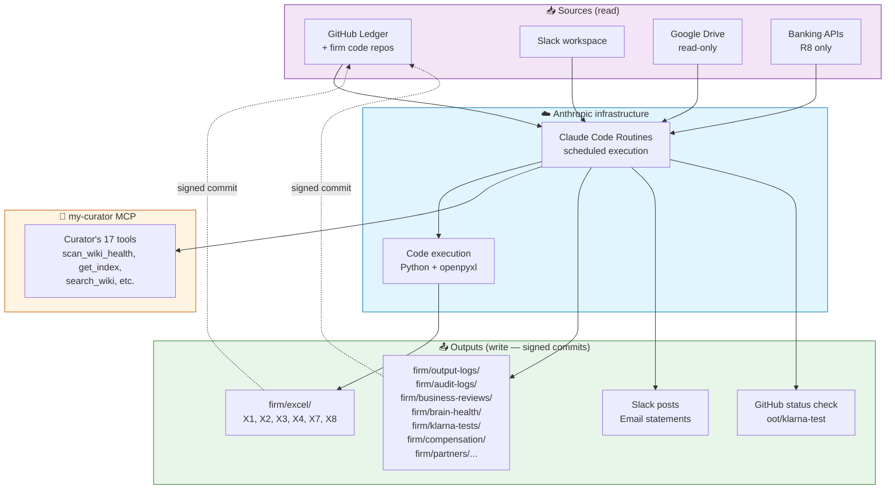
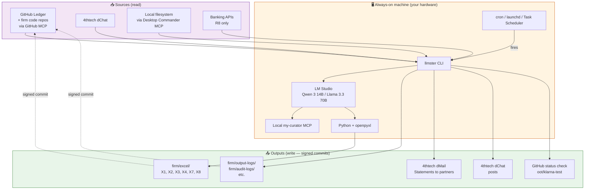
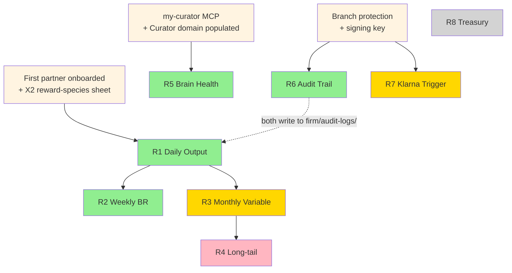

# Automation pipeline — how the 8 Routines fit together

**Audience:** Founder. After the install. Trying to understand the whole automation picture before configuring Routines.
**Time to read:** 15 minutes.
**You will end with:** a clear mental model of what each Routine does, when it fires, what depends on what, and what you actually need to set up *for your situation* — vs. what to defer.

> 📖 If you haven't read [`docs/MODULES.md`](MODULES.md) yet, do that first — this doc assumes you know the module-dependency map.

---

## What "automation" means in ØØT

The framework ships **eight scheduled Routines (R1–R8)** that turn the firm's daily work into compounding state. Each Routine is a prompt + a schedule + a set of integrations. It runs automatically (no human at the keyboard), reads from a few sources, writes to your Ledger via signed commits, and notifies the team on Slack / dChat.

The Routines are the *only* automation in Gen 1. Everything else (partner onboarding, Klarna scoring, output spec drafting) is human-driven with AI assistance, not scheduled.

Two execution substrates, identical prompts:

- **Cloud track** — Claude Code Routines run on Anthropic's infrastructure. **Your laptop can be closed; no dedicated machine required.** Per-day limits: 5 (Pro) / 15 (Max) / 25 (Team/Enterprise). [Anthropic launch announcement →](https://claude.com/blog/introducing-routines-in-claude-code). You manage them from any of three interfaces (all configure the same cloud-hosted feature):
  - **Claude Code CLI** in your terminal: `/schedule` command
  - **Web dashboard:** [claude.ai/code/routines](https://claude.ai/code/routines)
  - **Claude Code desktop app:** "New Remote Task" feature *(this is the Claude Code-specific desktop app, distinct from Claude Desktop chat)*
- **Privacy track** — cron / launchd / Task Scheduler on your always-on machine, hitting headless LM Studio via `llmster`. **Privacy track is the one that needs a dedicated machine.** That's the structural trade-off vs. cloud track's sovereign-but-laptop-must-be-on cost.

---

## The 8 Routines at a glance

| # | Schedule | What it does | What it produces | Day-1? |
|---|---|---|---|---|
| **R5** | Sunday 09:00 | Curator brain-health scan + auto-fix safe issues | `firm/brain-health/<YYYY-WW>.md` + `#brain-health` Slack post | ✅ first Routine to install — no dependencies |
| **R6** | Daily 23:00 | Capture today's AI decisions → daily audit log (signed commit) | `firm/audit-logs/<YYYY-MM-DD>.md` + X7 Audit_Log_Index | ✅ mandatory for EU founders; recommended otherwise |
| **R1** | Daily 18:00 | Capture partner outputs (commits, contracts, deals) → X1 Output_Log | New rows in X1 + `firm/output-logs/<YYYY-MM-DD>.md` | ✅ but needs first partner with X2 sheet |
| **R2** | Friday 08:00 | Build the Friday BR agenda; populate X3 | X3 Weekly_Review row + Slack draft + `firm/business-reviews/<date>.md` | ✅ but needs R1 with 7+ days of data |
| **R3** | 1st of month 09:00 | Calculate monthly variable pay; per-partner statements; founder approval packet | X1 Monthly_Variable + per-partner statement Brain pages + email to each partner | ⏸ wait for R1 to have 30+ days of data |
| **R4** | 1st of quarter 09:00 | Settle quarterly long-tail entitlements per X2 | X2 Long_Tail_Schedule rows + per-partner long-tail statements | ⏸ first quarter close |
| **R7** | GitHub event (PR labeled `ai-replaces-human`) | Block PR merge; assign non-beneficiary reviewer; populate X4 | X4 Decision_Log + GitHub status check + `firm/klarna-tests/<test-id>.md` | ⏸ first AI-replaces-human PR |
| **R8** | Monday 08:00 | Treasury runway snapshot; threshold alerts | X8 Runway_Calc snapshot row + alert if runway < 9 months | ⏸ optional — Unit Fund only |

---

## The two main Legos

The framework's cloud-track automation rests on **two pieces of infrastructure** plus a few smaller dependencies:

```
┌──────────────────────────────────┐         ┌──────────────────────────────────┐
│   ANTHROPIC CLOUD                │  git    │   GITHUB BRAIN REPO              │
│                                  │ ◄────►  │   (canonical source of truth)    │
│   Claude Code Routines           │  ops    │                                  │
│   + code execution sandbox       │         │   firm/excel/X1...X9.xlsx        │
│   + connectors (GitHub, Slack)   │         │   firm/output-logs/*.md          │
│                                  │         │   firm/audit-logs/*.md           │
└──────────────────────────────────┘         └──────────────────────────────────┘
                                                            ▲
                                                            │ git pull / push
                                                            │ (manual or GUI-app)
                                                            ▼
                                              ┌──────────────────────────────────┐
                                              │   YOUR LOCAL WORKING CLONE       │
                                              │   /Users/<you>/<firm-folder>/    │
                                              │                                  │
                                              │   You view + manually edit       │
                                              │   .xlsx files here in Excel /    │
                                              │   LibreOffice / Numbers          │
                                              └──────────────────────────────────┘
```

That's the whole picture. **Your laptop can be closed** — the Routines run on Anthropic's cloud and write directly to GitHub. **GitHub is the source of truth** for both Routines and humans. **Your local clone is just a working copy** that pulls from GitHub when you want to see fresh state.

### Where does the code execute?

When a Routine fires:

1. Anthropic spins up a fresh sandbox container on their infrastructure.
2. Claude Code (the agent) runs inside that sandbox with a Python interpreter, `openpyxl`, the standard library, and any other packages the framework needs.
3. The agent clones your Ledger into the sandbox, mutates the `.xlsx`, signed-commits, pushes back.
4. The sandbox is torn down. Nothing persists on Anthropic's side except billing/usage logs.

Each Routine fire is its own ephemeral sandbox. They don't share state across runs — state lives on GitHub.

### Keeping your local clone in sync

When a Routine pushes a commit, the change lands on GitHub immediately. Your local clone at `/Users/<you>/<firm-folder>/` does **NOT** auto-update. To see fresh state, run:

```bash
cd <firm-folder>
git pull
```

Three options for staying in sync:

| Option | How | When it suits |
|---|---|---|
| **Manual `git pull`** | Run before viewing / editing | Simplest; you control when (recommended for solo founders) |
| **GitHub Desktop app** | Free GUI app; auto-fetches every few minutes when running | If you want a status indicator + click-to-pull UX |
| **Editor auto-sync** | VS Code git extension, Obsidian git plugin, or a small `git pull` cron job on your laptop | Hands-off, but only runs when laptop is on |

For most founders: manual `git pull` is fine. Routines write to GitHub; when you open your laptop and want today's state, you pull. The `.xlsx` files are mostly *written by Routines + read by humans*; real-time sync isn't necessary.

### Agent-as-daily-UI (recommended for non-technical founders)

`git pull` is a one-line command, but for a non-technical founder it's the kind of one-line command that easily doesn't get done. **Better pattern:** use the same coding agent that installed the framework (Claude Code, Augment, Aider, OpenCode, Cline) as a daily-driver assistant. Three short playbooks the agent reads:

- [`installer/agent-assisted/DAILY-OPS.md`](../installer/agent-assisted/DAILY-OPS.md) — every morning. Agent runs `git pull`, summarises what changed, surfaces anomalies, verifies signing key health, updates `~/.oot/firm-state.yaml`. ~2 minutes of your attention.
- [`installer/agent-assisted/WEEKLY-OPS.md`](../installer/agent-assisted/WEEKLY-OPS.md) — Fridays before the BR + Sundays for brain-health. Agent reads R2's agenda + R5's health snapshot and walks you through.
- [`installer/agent-assisted/MONTHLY-OPS.md`](../installer/agent-assisted/MONTHLY-OPS.md) — 1st of month + the 5 business days after. Agent surfaces R3's variable-pay draft, polls partner acknowledgements, walks you through the founder-approval flow.

Each playbook has a copy-paste prompt at the top — you don't type git commands; you type one English sentence and the agent does the work. The agent already has GitHub access from the install (GitHub OAuth or a PAT), so no extra setup needed.

For founders who prefer not to use a coding agent for daily ops: GitHub Desktop ([desktop.github.com](https://desktop.github.com/)) provides a graphical "fetch + pull" UX with a click. Less powerful than the agent (no anomaly surfacing, no acknowledgement polling, no failure diagnostics) but gets the basic sync done.

**Gen-2 candidate:** an ØØT desktop application that wraps the agent-as-daily-UI pattern in a native macOS / Windows / Linux app with auto-sync, a dashboard, and click-to-acknowledge for partner statements. Tracked in [`GENERATIONS.md`](../GENERATIONS.md).

---

## Connectors needed per Routine

Each Routine needs a specific set of connectors configured in the Claude Code Routines dashboard. The universal requirement is **GitHub** (with the Ledger cloneable + pushable + signing key) plus **code execution** (default for Pro+). Beyond that, each Routine adds the specific connectors it needs.

| Routine | GitHub | Code exec | Slack | Email | Drive | my-curator MCP | Banking |
|---|---|---|---|---|---|---|---|
| R1 — Daily Output Capture | ✅ | ✅ | ✅ read+post | — | optional, read-only | optional¹ | — |
| R2 — Weekly BR Prep | ✅ | ✅ | ✅ post | — | — | optional | — |
| R3 — Monthly Variable | ✅ | ✅ | ✅ post | ✅ send | — | — | — |
| R4 — Long-tail Settlement | ✅ | ✅ | ✅ post | ✅ send | — | — | — |
| R5 — Brain Health | ✅ | optional | ✅ post | — | — | **required**¹ | — |
| R6 — EU AI Act Audit | ✅ | ✅ | ✅ post on errors | — | — | optional¹ | — |
| R7 — Klarna Trigger | ✅ | ✅ | ✅ post | ✅ send | — | — | — |
| R8 — Treasury (optional) | ✅ | ✅ | ✅ post | ✅ alert | — | — | ✅ jurisdiction-specific |

¹ **my-curator MCP is local to your machine, not reachable from Anthropic's cloud.** R5 (Brain Health Check) used to be broken on cloud track because of this. **Resolved in v1.0.1 by the Second Brain bridge** — see [How the bridge works](#how-the-bridge-works-cloud-routines-reaching-the-second-brain-via-curator-github-sync). R5 now clones the Curator-synced Second Brain repo at execution time (scoped to `wiki/<firm-curator-domain>/`) and scans markdown files directly.

### What each connector does

- **GitHub** — primary connector. Clones the Ledger into the Routine's sandbox at fire time; signed-commits and pushes back at end. Also reads commit/PR history of firm code repos for R1's output capture. **Universal requirement.**
- **Code execution (Python + openpyxl)** — runs the openpyxl script that mutates `.xlsx` files inside the cloned Ledger. Default for Pro+ Anthropic plans; verify enabled when configuring each Routine.
- **Slack** — read tracked channels (R1: `#output`, `#commercial`, `#sales` for tags); post to result channels (`#output-log`, `#brain-health`, `#klarna-test`, etc.). Configure per-Routine which channels.
- **Email** — for sending per-partner statements (R3 monthly variable, R4 long-tail, R7 Klarna trigger). Anthropic's native email connector or a third-party Gmail/Outlook MCP.
- **Google Drive / Workspace** — *optional*, read-only. Only used by R1 if your firm tracks Drive folders for documents-as-output. Not used by any Routine that mutates state — Drive is never the source of truth (per ADR-001).
- **my-curator MCP** — *local stdio MCP* on your machine; not reachable from Anthropic's cloud. Cloud Routines bridge this via the Curator's two-way GitHub sync (see [How the bridge works](#how-the-bridge-works-cloud-routines-reaching-the-second-brain-via-curator-github-sync)). Privacy-track Routines reach my-curator directly since everything runs on the same always-on machine.
- **Banking APIs** — jurisdiction-specific HTTP APIs. Most large banks expose REST endpoints; the Routine calls them with API keys stored as Routine secrets.

### Configuring connectors

In Claude Code Routines (whether via the CLI's `/schedule`, the web at https://claude.ai/code/routines, or the Claude Code desktop app):

1. **GitHub connector** — when prompted, authorise GitHub OAuth for the bot identity. Grant `repo` scope on the Ledger. The signing key (uploaded at install time to GitHub's GPG keys) is what Claude Code uses to sign commits.
2. **Slack connector** — install the [Claude Slack integration](https://slack.com/apps/A0848GFRZ54-claude) in your Slack workspace if not already. The Routine references channels by name; Anthropic handles the OAuth.
3. **Email connector** — typically Gmail or Outlook OAuth. Some firms use a dedicated transactional-email service (Postmark, SendGrid) via API key — works as a Routine secret.
4. **Google Workspace connector** — OAuth flow in Claude Desktop / Claude Code; grants read-only Drive access. **Note:** the connector is read-only for Sheets in place per Anthropic's docs; .xlsx state never lives in Drive (ADR-001).
5. **Code execution** — toggle in Routine settings; verify "Allow code execution" is on.
6. **Banking** — jurisdiction-specific. Some are OAuth (Stripe, Wise); most banks are HTTP API keys you store as Routine secrets.

The framework does not require any specific paid Slack/Email plan; free tiers work for pilot. The Anthropic plan tier (Pro / Max / Team) is what gates per-day Routine runs — see the schedule timeline below.

---

## How does a Routine touch the `.xlsx` files? (Pattern C, ADR-001)

**This is the framework's most important architectural decision and the most common point of confusion.** A cloud Routine running on Anthropic's infrastructure does NOT reach into your local machine. Instead:

```
Routine fires (Anthropic infra)
   │
   ├─► git clone https://github.com/<you>/<brain-repo> /tmp/brain
   │
   ├─► openpyxl.load_workbook('/tmp/brain/firm/excel/X1.xlsx')   ← reads from the cloned copy
   │
   ├─► append rows; write K, L formulas; save                    ← mutation in cloud sandbox
   │
   ├─► git commit -S -m "R1: append <N> outputs"                 ← signed commit
   │
   └─► git push origin main                                       ← pushes back to GitHub
```

The `.xlsx` file lives in your GitHub Ledger. **GitHub is the canonical store.** Your local copy at `/Users/<you>/<firm-folder>/` is a working clone you keep in sync with `git pull`. The Routine has its own working clone in its cloud sandbox — they never touch each other directly. They round-trip through GitHub.

This is **track-symmetric**: privacy-track Routines do the same operation (clone → openpyxl → signed commit → push), just from your always-on machine instead of from Anthropic's cloud. Both cloud and privacy versions of R1 hit the same Ledger on GitHub.

**Why this matters for your install:**

- ✅ You keep your `.xlsx` files in your firm folder locally for editing in Excel / LibreOffice / Numbers
- ✅ The Routines work without any local-file-access wizardry (no remote desktop, no hosted file shares, no syncing daemons)
- ✅ Every Routine mutation is a signed commit — your audit trail is automatic
- ✅ Multiple founders / partners can edit the same X1 from different machines via normal `git pull` / `git push`
- ✅ The framework works the same on cloud and privacy tracks

**Why we picked this over the abandoned alternatives** ([ADR-001](internal/ADR-001-cloud-routine-excel-writeback.md) full reasoning):

| | Approach | Why we said no |
|---|---|---|
| A | Native Google Drive connector writes Sheets in place | Connector is read-only for Sheets |
| B | Google Sheets via remote MCP | Loses openpyxl formulas; vendor lock; hosted-MCP burden |
| D | Remote Excel MCP server | Adds a hosted server to maintain; functionally equivalent to Pattern C with extra moving parts |
| **C** | **Routine clones Ledger, openpyxl + signed commit + push** | **Track-symmetric, native .xlsx preserved, audit trail automatic, no extra infrastructure** |

---

## Cloud track pipeline



**Key flows:**

1. **Read sources** — Routine fires on schedule (or GitHub event for R7). Pulls today's commits/PRs from GitHub, watched Slack channels, watched Drive folders, banking APIs (R8).
2. **Process via Anthropic-hosted Claude** — the Routine prompt runs on Anthropic infrastructure. Code execution available for openpyxl + signed commits.
3. **Read/write Brain via my-curator MCP** — for Routines that touch the Curator (R5 mainly, R6 to find agent decisions).
4. **Write operational state** — `.xlsx` mutations via openpyxl in code execution; markdown Brain pages directly. Signed commits push to `main`.
5. **Notify** — Slack posts, email statements.

---

## Privacy track pipeline



**Key flow differences from cloud:**

- **Substrate**: cron / launchd / Task Scheduler on your always-on machine instead of Anthropic infrastructure.
- **Model**: local (Qwen 3 14B for daily; Llama 3.3 70B for R3 high-stakes) instead of Claude.
- **Comms**: 4thtech dMail/dChat replaces Slack/email.
- **Discovery**: Desktop Commander MCP for local files; GitHub MCP for the Ledger (still GitHub-hosted).
- **my-curator MCP**: runs locally on the always-on machine — same machine as the Routines. **No reachability gap.**
- **Reliability constraint**: only fires while the machine is on. UPS strongly recommended.

---

## Routine schedule timeline

What fires when, in a typical week:

```mermaid
gantt
    title Weekly Routine schedule (cloud or privacy)
    dateFormat HH:mm
    axisFormat %H:%M

    section Sunday
    R5 Brain Health        :08:00, 60m

    section Monday
    R8 Treasury (optional) :08:00, 30m

    section Tue–Thu
    R1 Daily Output Capture :crit, 18:00, 30m
    R6 Daily Audit Trail    :crit, 23:00, 30m

    section Friday
    R2 Weekly BR Prep       :08:00, 30m
    R1 Daily Output Capture :crit, 18:00, 30m
    R6 Daily Audit Trail    :crit, 23:00, 30m

    section Saturday
    R1 Daily Output Capture :crit, 18:00, 30m
    R6 Daily Audit Trail    :crit, 23:00, 30m

    section Event-driven
    R7 Klarna Trigger       :milestone, 12:00, 0m

    section Monthly (1st)
    R3 Monthly Variable     :crit, 09:00, 90m

    section Quarterly (1st of Q)
    R4 Long-tail Settlement :crit, 09:00, 120m
```



**Daily run count for plan-tier sizing:**

- Tue–Thu: R1 + R6 = 2/day
- Friday: R2 + R1 + R6 = 3/day
- Sunday: R5 = 1/day
- Monday: R8 (optional) + R1 + R6 = 2-3/day
- Saturday: R1 + R6 = 2/day
- 1st of month: R3 + the daily Routines = 3-4 fires (plus 5-7 polling fires for partner ack across the next 5 business days)
- 1st of quarter: R4 + R3 + daily = 4-5 fires
- R7: ad-hoc; +1 per ai-replaces-human PR

**Steady state**: ~2.3 runs/day average. Pro plan (5/day) handles this for solo / 2-partner. Above that, Max plan (15/day).

---

## Dependency graph

Which Routine needs what other Routine's data?



**Reading the graph:** orange boxes = pre-requisites (one-time setup); green = Day-1 Routines; gold = Day-30 / Day-90; pink = Day-90+; grey = optional. Every Routine that mutates `.xlsx` needs the signing key (so they all transitively depend on `Branch`).

---

## How the bridge works: cloud Routines reaching the Second Brain via Curator GitHub sync

**The gap, restated:** Claude Code Routines run on Anthropic's infrastructure. They can call MCP servers, but only **remote-HTTP / SSE MCPs** — not local stdio MCPs. The Curator desktop app installs my-curator as a stdio MCP (or local-HTTP at `127.0.0.1:8765`), reachable from Claude Desktop on the founder's machine but **not from Anthropic's cloud**. Without a workaround, R5 (Brain Health Check) — the only Day-1 Routine that genuinely needs Second Brain access — has nothing to scan.

**The Gen-1 solution: the Curator's existing two-way GitHub sync.** Curator already ships a sync feature: it pushes the entire local vault (all wiki domains, conversations, schemas) to a private GitHub repo, two-way, with conflict-handling via rebase. Once that's enabled, the Second Brain content lives on GitHub in plain markdown form — and cloud Routines can clone it at execution time, scoped to the firm's Curator domain folder (`wiki/<firm-curator-domain>/`).

This is what the wizard's **Step 12 — Second Brain bridge** configures, and what R5's v1.2.0 prompt body uses:

```
1. Routine clones the Ledger   (read-write,  GPG-signed commits — for the report writeback)
2. Routine clones Second Brain (read-only,  fine-grained PAT Contents:Read — for the scan)
3. Routine scans wiki/<firm-curator-domain>/*.md for broken wikilinks, orphans, stale pages
4. Routine writes the report  to firm/brain-health/YYYY-WW.md in the Ledger
5. Routine commits + pushes   (Ledger; the Second Brain repo is read-only)
```

**Routine-by-Routine impact of the bridge:**

| Routine | Needs Second Brain? | Status without bridge | Status with bridge |
|---|---|---|---|
| R5 (Brain Health Check) | Yes — entire job | **Broken** on cloud | ✅ Works |
| R2 (Weekly BR Prep) | Marginal — could enrich agenda | Works (reads Ledger only) | Could enrich but not required Gen-1 |
| R8 (Quarterly Sentiment) | Marginal | Works (reads Ledger only) | Could enrich but not required Gen-1 |
| R1 (Daily Output Capture) | No — partner-id lookups via X2 Excel | Works | Works |
| R3, R4, R6, R7 | No | Work | Work |

**Trade-offs the bridge accepts:**

- **Lost:** the 17 my-curator MCP tools. Cloud Routines fall back to plain markdown parsing + grep. For R5 this is enough (broken-wikilink detection and orphan scans are file-level operations). For *semantic similarity* (`scan_semantic_duplicates`, `get_connected_nodes`, cross-domain queries), cloud Routines remain limited — defer to Gen-2.
- **Auto-fix capability:** R5 on cloud track can *list* typo-correctable broken wikilinks but cannot auto-fix them (the Second Brain repo is read-only from cloud — fixes must go through the Curator app, which then syncs back to GitHub). Privacy-track R5 keeps the auto-fix behaviour.
- **Sync freshness:** the Second Brain on GitHub is as fresh as the user's last "Sync Up" in the Curator app. R5's report includes the latest-sync timestamp so this is visible.

**Three founder paths from here:**

1. **Recommended (Gen-1 cloud-track default):** Enable Curator GitHub sync at wizard Step 12, install R5. Works for ~95% of founders without an always-on machine.
2. **Advanced / sovereignty-mandate:** Privacy track. my-curator MCP runs locally on a Mac mini / NUC / Pi 5 alongside the Routines. Full 17-tool access, no sync lag. ~€2,400 hardware + maintenance overhead.
3. **Wait for cloud Curator MCP:** Hosted Curator variant on the project's Q3 2026 roadmap. When it lands, the bridge can be deprecated; until then, the GitHub-sync bridge is the right approach.

**Skip the bridge entirely?** Yes — set `curator_mode: skip-for-now` at Step 5. R5 will then commit empty reports flagged "Second Brain unreachable" each Sunday, and other Routines (R1, R6, R7) continue to work. Add the bridge later when you're ready.

Setup detail: see [`installer/wizard.py`](../installer/wizard.py) `step_12_secondbrain_sync` for the install-time wiring, and [`routines/cloud/R5.md`](../routines/cloud/R5.md) for the R5 prompt body that consumes the bridge.

---

## What to install in YOUR situation

The framework is designed so you can add Routines incrementally. Match your situation to one of these:

### A. Solo founder, no partners yet, just exploring

Don't install Routines yet. None of them produce useful output until you have partners or a populated Brain. Instead:

- Ingest 5–10 documents into your Curator domain to populate the Brain.
- When you onboard your first partner (real one — 4thtech or PollinationX, in your case): start with R6 (audit trail), then R1 (daily output capture).
- R5 / R7 / R3 / R4 / R8: defer until later milestones per [`docs/MODULES.md`](MODULES.md).

This is your situation right now. The next useful action is **Curator domain ingest, not Routines**.

### B. Solo founder, first partner imminent (next 2 weeks)

Install R6 first (one-time setup; daily silent commits don't depend on partners). Then install R1 the day before the partner onboards (so day-one of partnership has R1 capturing).

Pro plan is sufficient.

### C. 2–3 partner firm with Klarna gate active

Install R5 + R6 + R1 + R2. Configure R7 (Klarna gate) before any AI-replaces-human PR opens. Upgrade to Max plan before R3's first month-end firing.

### D. Privacy track founder with always-on machine ready

All 4 Day-1 Routines (R5, R6, R1, R2) install identically on the always-on machine via cron / launchd. No my-curator reachability gap; everything's on one box. R5 is genuinely useful from Day-1 because the local-LLM ingest produces wikilinks that occasionally need Curator's `fix_wiki_issue`.

---

## Where to go from here

- **For the Routine prompt bodies + setup checklists:** [`routines/cloud/<R>.md`](../routines/cloud/) (cloud) or [`routines/privacy/<R>.md`](../routines/privacy/) (privacy).
- **For the canonical install order:** [`routines/README.md`](../routines/README.md).
- **For the operational state schemas (X1...X9):** [`templates/excel/SPEC.md`](../templates/excel/SPEC.md).
- **For end-to-end install:** Path A ([`installer/agent-assisted/cloud-install-plan.md`](../installer/agent-assisted/cloud-install-plan.md) Step 10), Path B (`python3 installer/wizard.py` Step 12), or Path C ([`docs/00-quickstart-cloud.md`](00-quickstart-cloud.md) "Sunday afternoon").
- **For semantic / graph-traversal queries** (the 17 MCP tools): the GitHub-sync bridge handles file-level scans for R5 in v1.0.1; full MCP tool surface on cloud track waits for Anthropic's hosted Curator (Q3 2026 roadmap) or a stateless cloud-MCP variant in Gen-2.
