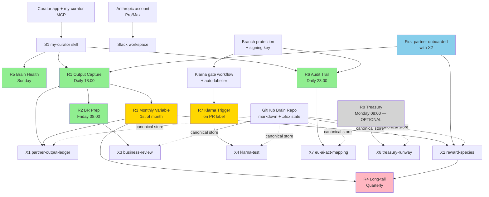

# Modules — what to install, in what order, and what's optional

**Audience:** Founders deciding what to install on Day-1 vs. defer.
**Time to read:** 10 minutes.
**You will end with:** a clear picture of the framework's minimum-viable shape, the dependency graph, and a phased install path that matches your firm's size and timeline.

> 📖 If you've not read these yet, read them first: [`MANIFESTO.md`](../MANIFESTO.md) (15 min), [`docs/00-quickstart-cloud.md`](00-quickstart-cloud.md) (Day-1 cloud install), [`docs/internal/ADR-001-cloud-routine-excel-writeback.md`](internal/ADR-001-cloud-routine-excel-writeback.md) (where state lives).

---

## The absolute minimum to operate (Day-1)

A solo founder on cloud track can run a usable ØØT instance with **five modules**. Everything else is additive.

1. **Anthropic account** (Pro plan minimum; Max recommended once you have 3+ partners or the Klarna gate is firing). Powers Claude Desktop, Claude Code, and Claude Code Routines.
2. **GitHub Ledger** — your firm's private repo. Holds the markdown wiki + the `.xlsx` operational state files (`firm/excel/X1...X9.xlsx`). This is your firm's most valuable IP by month six.
3. **Curator desktop app + my-curator MCP** — the Brain interface. Skill Pack S1 is its canonical SKILL.md. Without this, no other Skill Pack works at full strength.
4. **Routine R5 (Brain Health Check)** — runs Sunday 09:00; verifies your Brain is intact week-on-week. R5 has no dependencies on other Routines and is the smoke-test that confirms everything else is wired correctly. On the **cloud track** it does require the Second Brain bridge (Curator GitHub sync + a fine-grained read-only PAT — see [`docs/00-quickstart-cloud.md`](00-quickstart-cloud.md) Step 8c); privacy-track R5 talks to the local my-curator MCP directly.
5. **A spreadsheet app** to view the `.xlsx` files. User choice: Microsoft Excel, **LibreOffice (free, open-source)**, Apple Numbers (built into macOS), Excel for Web, WPS, OnlyOffice. The framework writes native `.xlsx` and is app-agnostic.

That's the floor. With those five, you have: a Brain that grows, a weekly self-check that proves it's growing, a stack of `.xlsx` templates ready to be filled in, and a path to add everything else as the firm matures.

---

## No Anthropic subscription? The community track

The Day-1 minimum above assumes the **cloud track** (Anthropic account, module 1). If you don't have a subscription budget — and don't need the privacy track's sovereignty (dedicated hardware, Trezors, 4thtech) — there's a third configuration: the **community track**, defined in [`docs/internal/ADR-003-community-track-no-subscription.md`](internal/ADR-003-community-track-no-subscription.md). It's free-to-start, no Anthropic subscription, no dedicated hardware. Everything except the harness and the scheduler is byte-identical to the other tracks — the Routines, Skill Packs, Excel templates, and governance are the same files.

| Layer | Community-track choice |
|---|---|
| Install + daily-ops harness | **OpenCode** — free built-in models, your own API key, or a local model. Setup: [`installer/agent-assisted/OPENCODE-SETUP.md`](../installer/agent-assisted/OPENCODE-SETUP.md). |
| Ledger + Firm Brain | GitHub — **unchanged** (ADR-001 / ADR-002 apply verbatim). |
| Brain ingest | Curator + Gemini Flash Lite pay-as-you-go (~€5-10/month). |
| Klarna gate (R7) | GitHub Actions — free, identical to the other tracks. |
| Scheduled Routines | **Three-rung automation ladder** — (1) manual playbook runs (zero setup), (2) laptop cron running `opencode run`, (3) GitHub Actions scheduled workflows (laptop-closed, still no subscription). |

The trade-off is honest: only Rung 3 gives you laptop-closed automation, and Rung 3 transits your Ledger content through the model provider you point it at (EU founders apply the same S7 assessment as on cloud). The community track makes **no sovereignty claims** — if you have a privacy mandate, use the privacy track. Full detail, install steps, and the automation ladder are in [ADR-003](internal/ADR-003-community-track-no-subscription.md) and [`OPENCODE-SETUP.md`](../installer/agent-assisted/OPENCODE-SETUP.md).

---

## The dependency graph (visual)

**Legend:** green = Day-1 (R5, R6, R1, R2). gold = Day-30 to Day-90 (R3, R7). pink = Day-180+ (R4). grey = optional / Unit-Fund only (R8). blue = onboarding gate (first partner).

---

## Day-N progression — what to add and when

| Day | What you install | Why now |
|---|---|---|
| **Day 1** | Anthropic + GitHub + Curator + S1 + R5 + spreadsheet app | The minimum-viable Brain. R5 confirms the stack is wired. |
| **Day 1–7** | + Slack workspace + Claude integration; + Obsidian (optional, recommended). | Comms layer + human-readable Brain view. |
| **Day 1 (EU founders)** | + R6 + branch protection + signing key + S7 + X7 | Article 12 audit trail starts day-1, not day-90. |
| **Day 1 (everyone else, recommended)** | + R6 + branch protection + signing key | Audit trail discipline pays for itself the first time you have a contested decision. |
| **Day 7–14** | + first partner onboarded (X2 + Charter + first Output Spec) + R1 + S3 | Compensation discipline starts here. R1 needs a partner with X2 to capture against. |
| **Day 14–30** | + R2 (needs 7+ days of R1 data) + S5 | Friday Business Review cadence kicks in. |
| **Day 30+** | + R3 (needs 30+ days of R1 data) + S3 deepening | Monthly variable pay calc + per-partner statement workflow. |
| **Day 30+ (if AI is replacing partner work)** | + Klarna gate workflow + auto-labeller + R7 + S4 + S6 + X4 | The Klarna Test starts enforcing on PRs. |
| **Day 90+** | + R4 (after first quarter ends) + S10 if you adopt long-tail | Quarterly long-tail settlement. |
| **Day 180+ (if adopting Unit Fund)** | + R8 + S10 deepening + X8 | Treasury runway monitoring. |
| **As-needed** | S7-S11 hardening (Tier-2 v1.x); recommended-but-optional security (Bitwarden org, Yubikey); Trezor (Gen 2 only) | These don't block Day-1 operation. |

---

## Modules by category

### Foundation (everyone needs these on Day-1)

| Module | What it is | Required for |
|---|---|---|
| Anthropic account (Pro / Max) | Powers Claude Desktop, Claude Code, Claude Code Routines | Everything in cloud track |
| GitHub Ledger | Holds markdown wiki + `firm/excel/*.xlsx` state | Everything (per ADR-001) |
| Claude Desktop | Daily-driver UI | Day-to-day partner work |
| Claude Code | CLI for engineering + Routines runtime | All Routines (cloud) + S4 |
| Curator desktop app | Brain ingest engine | The Brain growing automatically |
| my-curator MCP | The 17-tool surface that lets Claude read/write the Brain as a graph | All Skill Packs that touch the Brain |
| **Skill Pack S1 (my-curator)** | The Curator's canonical SKILL.md, imported verbatim | Every Skill Pack that writes to the Brain |
| Slack workspace + Claude integration | Comms + Routine notifications | R1/R2/R5/R6/R7/R8 outputs |
| Spreadsheet app | View / manually edit `.xlsx` state | Human-in-the-loop edits to X1–X9 |

### Skill Packs

12 packs. Tier-1 (S1, S2, S3, S4, S5, S6, S12) are hardened in v1.0. Tier-2 (S7, S8, S9, S10, S11) are scaffolds — they work but are ~500 words rather than ~3000; v1.x will harden.

| Pack | Title | When to load |
|---|---|---|
| **S1** | my-curator | Day-1 (Brain interface) |
| **S2** | Context Engineering | Day-1 (good prompt discipline) |
| **S3** | Compensation & Attribution | Day-7 (when first partner onboards) |
| **S4** | Code & QA | Day-7 if you ship code; Day-30 if you don't |
| **S5** | Reporting & Business Review | Day-14 (when R2 fires its first BR) |
| **S6** | Change Management | Day-30 (when first Klarna gate fires) |
| S7 | Governance & Compliance | **Day-1 (mandatory) for EU founders.** Otherwise optional. |
| S8 | Legal Operations | When you draft your first partner contract |
| S9 | Marketing | When marketing is part of a partner's reward species |
| S10 | Finance & Treasury | If adopting Unit Fund (Gen 2 readiness) |
| S11 | Sales & BD | When sales is part of a partner's reward species |
| **S12** | Privacy / Self-Sovereign Stack | Day-1 if privacy track; never if cloud-only |

### Routines (R1–R8)

See [`routines/README.md`](../routines/README.md) for the canonical install order.

| # | When | Required? |
|---|---|---|
| R5 | Day-1 | Yes — no Routine dependencies; smoke-test. Cloud track needs the Second Brain bridge (read-only PAT); privacy track uses the local my-curator MCP. |
| R6 | Day-1 (EU founders) / Day-7 (everyone else) | Yes for EU; recommended for all |
| R1 | Day-7 (after first partner onboards with X2) | Yes |
| R2 | Day-14 (after R1 has 7+ days) | Yes |
| R3 | Day-30 (after R1 has 30+ days) | Yes |
| R7 | When first AI-replaces-human PR is opened | Yes if you ship code with AI |
| R4 | Day-90 (after first quarter ends, if long-tail adopted) | Optional |
| R8 | If adopting Unit Fund (Gen 2 readiness) | OPTIONAL |

### Excel templates (X1–X9)

All `.xlsx` files live in your Ledger at `firm/excel/`. Mutated by Routines per ADR-001.

| # | File | Loaded by | Required? |
|---|---|---|---|
| X1 | partner-output-ledger.xlsx | R1, R2, R3 | Yes (Day-7) |
| X2 | reward-species-declaration.xlsx | R3, R4, partner onboarding | Yes (Day-7) |
| X3 | business-review.xlsx | R2 | Day-14 |
| X4 | klarna-test.xlsx | R7 | If R7 is active |
| X5 | perception-gap-survey.xlsx | Quarterly survey | Day-90 |
| X6 | agent-skill-roi.xlsx | R2 | Day-30 |
| X7 | eu-ai-act-mapping.xlsx | R6 | EU founders |
| X8 | treasury-runway.xlsx | R8 | Unit Fund only |
| X9 | oot-readiness.xlsx | Self-assessment, pre-install | Day-0 (before install) |

### CI / Klarna gate

| Module | Required for | Setup |
|---|---|---|
| Branch protection on `main` (force-push off, deletion off, signed commits) | R6 audit trail to be immutable | One-time, one Settings page |
| `oot-bot` GitHub identity with signing key | All Routines that commit | One-time |
| `.github/workflows/klarna-gate.yml` | R7 enforcement | Already shipped in v1.0 |
| `.github/labeler.yml` | Auto-applies `ai-replaces-human` | Already shipped |
| Required status check `oot/klarna-test` in branch protection | Klarna gate to actually block | One Settings click |

### Recommended-but-optional security (per CLAUDE.md decision #13)

These improve the firm's security posture but **are not gating for a beginning founder**.

| Module | Recommend when | Skip until |
|---|---|---|
| Bitwarden personal | Day-1 (any password manager beats browser autofill) | — |
| Bitwarden organisation | When you have 2+ admins or hold customer data | — |
| Yubikey 5C NFC | When you have 2+ admins | Solo founder Day-1 |
| Trezor hardware wallet | Generation 2 (stablecoin payroll) | Until v2.0 |

### Privacy track only

If you're on the privacy track, *also* install:

- LM Studio + a local frontier model (Qwen 3 14B+, Llama 3.3 70B for R3, DeepSeek-V3 for code work)
- An always-on machine (Mac mini / NUC / Pi 5) with FDE + UPS
- 4thtech client + firm dMail domain (~€50/year)
- PollinationX storage NFT
- Trezor per partner (privacy track is the one place Trezor IS Day-1, because 4thtech wallet identity needs it)
- Excel MCP (`haris-musa/excel-mcp-server`) — *optional*, for ad-hoc human-in-the-loop work; the Routines themselves use openpyxl directly

See [`docs/00-quickstart-privacy.md`](00-quickstart-privacy.md) for the privacy-track Day-1 walkthrough.

---

## "I'm in situation X — what do I need?"

**Solo founder, cloud, Slovenia/EU, no partner yet:** Anthropic Pro + GitHub + Curator + S1 + R5 + LibreOffice + Bitwarden personal + R6 + branch protection + S7 + X7. *Optional:* Yubikey when you hire your second admin. *Skip:* Trezor.

**2-partner firm, cloud, EU, AI-replaces-human work coming:** Above + R1 + S3 + Charter + first X2 + Klarna gate workflow + S4 + S6 + R7 + X4 + branch-protection-required `oot/klarna-test` status check. **Upgrade to Anthropic Max** before R7 starts firing.

**5-partner firm, cloud, US, no Unit Fund:** Above + R2 + R3 + S5 + X3 + X6 + Bitwarden org + Yubikeys for all admins. R4 lands at first quarter close. *Skip:* R8 + X8 (Unit Fund only).

**Solo founder, privacy track, sovereignty mandate:** Privacy-track full stack — LM Studio + always-on machine + UPS + 4thtech + PollinationX + Trezor + S12 + S1 + R5 + R6 + R1 + LibreOffice. Plan ~25 hours over two weekends + 1 week of hardware shipping. See [`docs/00-quickstart-privacy.md`](00-quickstart-privacy.md).

**Cooperative / multi-stakeholder org adopting Unit Fund:** All of the above + R8 + S10 + X8. Wait 6-9 months on the YOLO model before opening the Unit Fund per `GENERATIONS.md`.

---

## What this page is *not*

- It's not a setup walkthrough. For step-by-step instructions, follow [`docs/00-quickstart-cloud.md`](00-quickstart-cloud.md) or [`docs/00-quickstart-privacy.md`](00-quickstart-privacy.md).
- It's not the source of truth for any module's spec. Each module has its own canonical doc — Skill Packs at `skills/<pack>/`, Routines at `routines/cloud/R<n>.md` and `routines/privacy/R<n>.md`, Excel templates at `templates/excel/SPEC.md`.
- It's not a contract. The framework is opinionated about what works (the Day-1 minimum is real), but if your firm's situation calls for a different ordering, follow the situation, not the table.

If you find a dependency the diagram or the table missed, open a PR — the framework's discipline applies to the framework itself.
